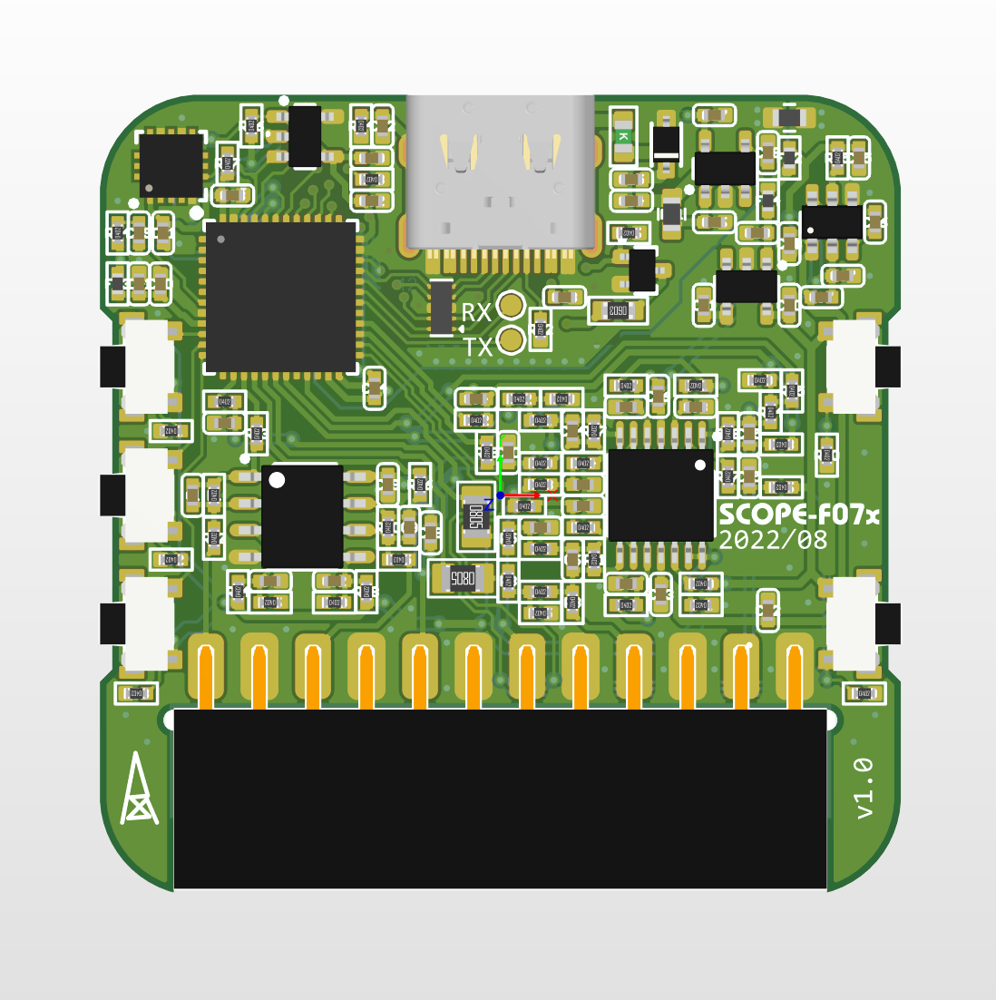
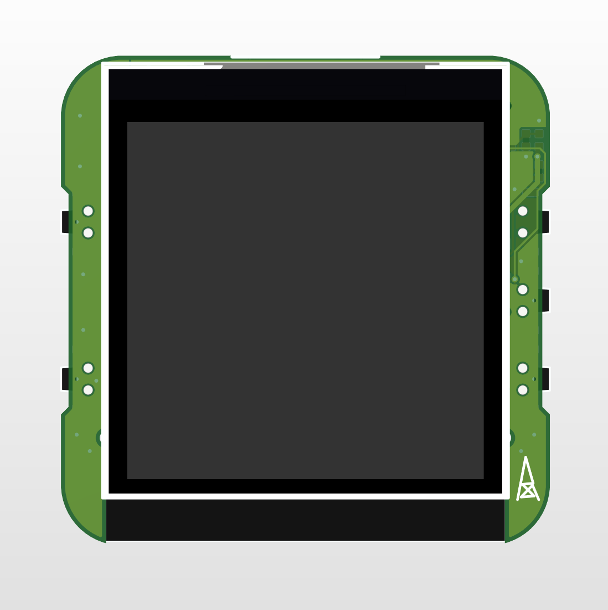

# SCOPE-F07x

### 关于

从硬禾SCOPE-F072的开源文件修改，软硬件均开源

零零散散修改的地方比较多，详见下文说明

### PCB

工艺：

- 板厚: 1.0mm 
- 过孔: 0.3/0.5mm
- 线宽线隙: 6mil/6mil
- 尺寸: 38x38mm

封装：绝大多数是0402

|  |  |
| -------------------- | -------------------- |

### 修改说明

硬件：

- Layout：完美居中、模数分离

- 模拟部分电源：从3.0V改为3.3V，也为STM32的VDDA供电

  > 因为这0.3V的变化，运放电路电阻取值经过重新计算，与EEtree的技术指标保持一致，，提供这部分LTspice仿真文件

- 运放：TP2302运放太冷门，改为SGM8552

- STM32的很多引脚变更，具体请看原理图说明

- 加速度计改为LIS3DH、EEPROM改为SOT-23封装、拨轮开关改为三个按键、其他细节见PCB工程文件

### 软件

原版程序有好几个大的数组(成员数量几百个个)，使用静态内存分配，运行时不能释放，导致固件编译后内存使用率95%以上，开Os优化编译后，Flash可用空间还有50KB以上，由于RAM剩余空间紧张，加速度计、EEPROM、屏幕背光、USB通讯、ADC反馈通道闭环控制等相关实现被裁剪

尝试使用动态内存分配，尽可能实现上述被裁剪的功能
