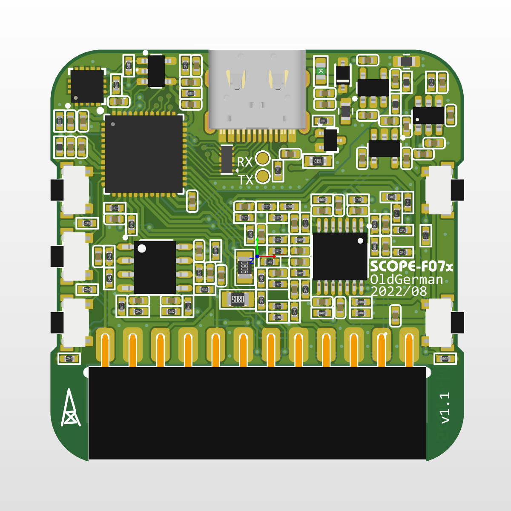
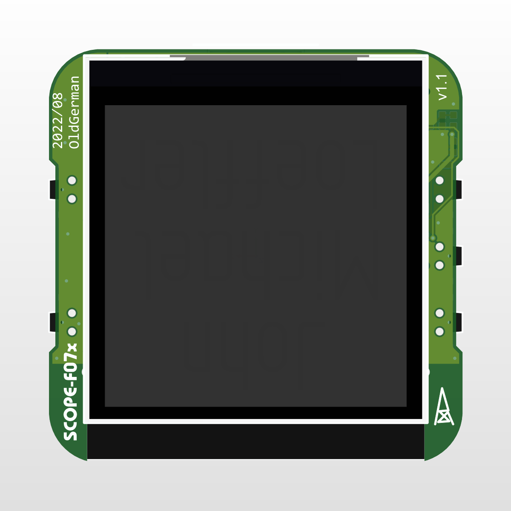

# [SCOPE-F07x](https://github.com/oldgerman/SCOPE-F07x)

### 关于

从 [硬禾SCOPE-F072](https://github.com/EETree-git/SCOPE-F072) 开源和公开资料修改

零零散散修改的地方比较多，详见本仓库相关文件说明

### PCB

工艺：

- 层数：2
- 板厚: 1.0mm 
- 过孔: 0.3/0.5mm
- 线宽线隙: 6mil/6mil
- 尺寸: 38x38mm

封装：绝大多数是0402，物料约40多种

|  |  |
| -------------------- | -------------------- |

### 修改说明

#### 硬件

- Layout：完美居中、模数电源分离

- type-c正反插功能不同，正插USB DFU，反插可以用stlink调试（D+: SWCLK，D-: SWDIO）

- 模拟部分电源：从3.0V改为3.3V，也为STM32的VDDA供电

  > 因为这0.3V的变化，运放电路电阻取值经过重新计算，与EEtree的技术指标保持一致

- 运放：TP2302运放太冷门买不到，改为SGM8632

- STM32：换为QFN-48封装，引脚变更较多，兼容STM32F071、STM32F072

- 电荷泵：LM2776芯片过于昂贵，换为便宜很多的SGM3204

- 加速度计换为LIS3DH

- EEPROM换为SOT-23封装，容量大小任意

- 拨轮开关换为三个按键

- 其他细节见PCB工程文件

### 外壳

建模OK，待打印测试

#### 软件

原版程序：

有好几个大的数组(成员数量几百个)，使用静态内存分配，运行时不能释放，导致固件编译后内存使用率95%以上，开Os优化编译后，Flash可用空间还有50KB以上，由于RAM剩余空间紧张，加速度计、EEPROM、屏幕背光、USB通讯、ADC反馈通道闭环控制等相关实现被裁剪

优化目标：

使用动态内存分配，尽可能实现上述被裁剪的功能

代码进度：

目前仅针对修改版PCB做了修改适配，暂时提供bin文件（除了示波器CH2频率无法显示，其他功能测试正常），优化还没开始搞，代码等改好了再说~

### 图片

| 自己测自己的发生的信号                           | 可调电压源双路输出20mA-30mA                                  | 可调电压源负4V输出                                           |
| ------------------------------------------------ | ------------------------------------------------------------ | ------------------------------------------------------------ |
|  |  |  |

### Acknowledgments

感谢硬禾团队
